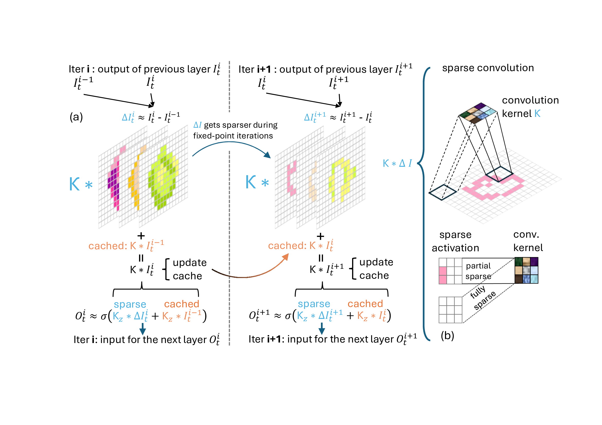

# DeltaDEQ: Exploiting Heterogeneous Convergence for Accelerating Deep Equilibrium Iterations

This code repository is largely based on the work "Deep Equilibrium Optical Flow Estimation, Bai et al. CVPR 2022". If you use the code, please consider citing our work and the DEQ papers including but not limited to:

```bib
@inproceedings{deq-flow,
    author = {Bai, Shaojie and Geng, Zhengyang and Savani, Yash and Kolter, J. Zico},
    title = {Deep Equilibrium Optical Flow Estimation},
    booktitle = {Proceedings of the IEEE Conference on Computer Vision and Pattern Recognition (CVPR)},
    year = {2022}
}
```

---
###  An illustration of CNN-based DetlaDEQ
<div align=center></div>

---

## A demonstration of the heteogeneous convergence phenomenon

Please refer to the fitting_sin.ipynb for a simple demonstration of the heterogeneous convergence phenomenon.


## Datasets
Download the following datasets and modify the dataset paths in DEQ_flow/code/core/datasets accordingly. For evaluation, you only need MPI Sintel and KITTI 2015.

- [FlyingChairs](https://lmb.informatik.uni-freiburg.de/resources/datasets/FlyingChairs.en.html#flyingchairs)
- [FlyingThings3D](https://lmb.informatik.uni-freiburg.de/resources/datasets/SceneFlowDatasets.en.html)
- [MPI Sintel](http://sintel.is.tue.mpg.de/)
- [KITTI 2015](http://www.cvlibs.net/datasets/kitti/eval_scene_flow.php?benchmark=flow)
- [HD1k](http://hci-benchmark.iwr.uni-heidelberg.de/)

## Checkpoints and Evaluation
Download the checkpoints from [Google Drive](https://drive.google.com/drive/folders/1KM7X0Uyfql2rDh6PgOAz1cb96I0Usnf2?usp=sharing) and evaluate with the script DEQ_flow/code/evaluate_with_delta.sh. Please modify the checkpoint paths and results storage paths in the script accordingly.


## Requirements

```bash
conda create --name deq python==3.6.10
conda activate deq
conda install pytorch==1.10.0 torchvision==0.11.0 torchaudio==0.10.0 cudatoolkit=11.3 -c pytorch -c conda-forge
conda install tensorboard scipy opencv matplotlib einops termcolor -c conda-forge
```


## Credit

This code repository is largely based on the work "Deep Equilibrium Optical Flow Estimation, Bai et al. CVPR 2022"
